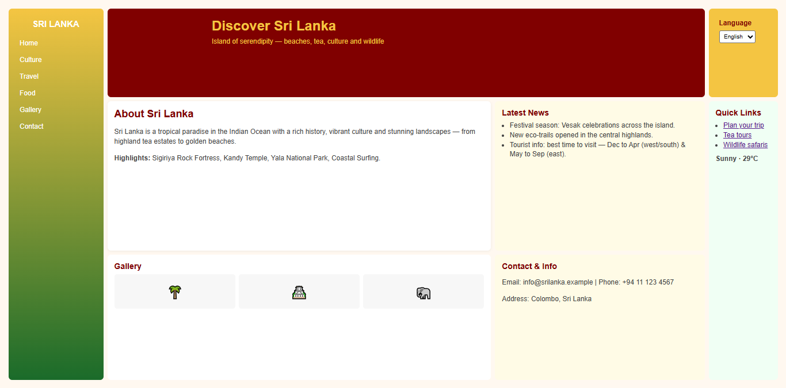

TEC - Day 2 Website

A small static website containing a few HTML pages and a stylesheet.

## 🌍 TEC — Day 2 Website

Welcome! This is a small, colorful static website created for the TEC Day 2 exercise. It contains a handful of HTML pages and a single stylesheet so you can open and explore the site locally in seconds.

---

### ✨ Quick overview

- Purpose: simple static site for learning and demonstration
- Tech: plain HTML + CSS (no build step)

### 📁 Project files

- `index.html` — Landing page
- `Home.html` — Home content
- `Culture.html` — Culture page
- `Food.html` — Food page
- `Travel.html` — Travel page
- `styles.css` — Site stylesheet

If you'd like to add images or screenshots, create a `screenshots/` or `assets/` folder and reference them from the pages.

---

### 🚀 Run / Preview locally

Open the site directly:

1. Double-click `index.html` or right-click → Open with your browser.

Or run a tiny local server (recommended for correct relative-path behavior):

```powershell
# from the project folder
python -m http.server 8000

# then open http://localhost:8000
```

If you use Visual Studio Code, the Live Server extension provides a one-click preview and auto-reload.

---

### 🎨 Styling & customization

- All site styles are in `styles.css` — edit this file to change colors, fonts, spacing, and layout.
- To add a custom favicon, drop a `favicon.ico` file in the root and add a link tag in `index.html`.

Quick CSS tips:

- Use CSS variables at the top of `styles.css` for easy theme changes.
- Keep responsive rules simple: a single media query for narrow screens is often enough for small projects.

---

### 🛠️ Development notes

- This is a static site (no server-side code). You can host it on GitHub Pages, Netlify, or any static host.
- When editing links between pages, ensure capitalization matches file names exactly (Windows is case-insensitive, but many hosts are case-sensitive).

---

### 🤝 Contributing

Contributions are welcome!

- Fixes and content updates: send a pull request.
- Larger changes: open an issue first so we can discuss scope and approach.

Please keep changes small and focused. If you add images, include them in an `assets/` folder and optimize their file size.

---

### 📜 License

This project is provided under the MIT License. See the `LICENSE` file for details. Replace the placeholder name/year in `LICENSE` with your information if needed.

---

### ✍️ Author

Add your name here (or an organization). Example:

Author: Your Name — replace this with your real name.

---

### 🖼️ Screenshot (example)

Below is an example screenshot included with this repository. It's currently a lightweight SVG placeholder located at `screenshots/example-screenshot.svg`.

You can replace that file with a real PNG or JPG screenshot and the README will display it automatically.



How to replace:

1. Create a `screenshots/` folder in the project root (if it doesn't exist).
2. Save your screenshot as `example-screenshot.png` (or keep the `.svg`).
3. Commit the file. The README will show the updated image.

Tip: Keep screenshots under ~200–400 KB for faster loads on GitHub.

If you want, I can also:

- Add a screenshot and show how to include it in the README
- Add a `CONTRIBUTING.md` or `CODE_OF_CONDUCT.md`
- Add live-preview instructions for other local servers (Node, http-server, etc.)

Small changes I can make now: add a screenshot example or include a short list of suggested CSS variables — tell me which and I'll add it.
